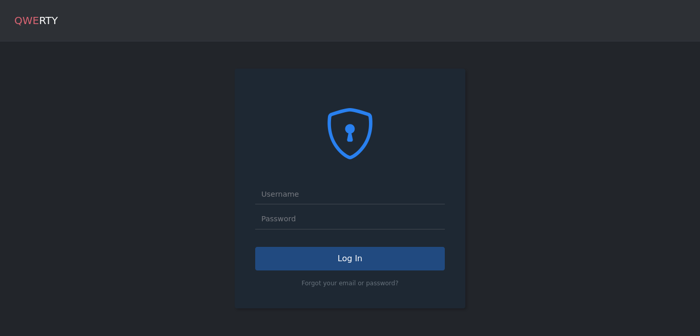
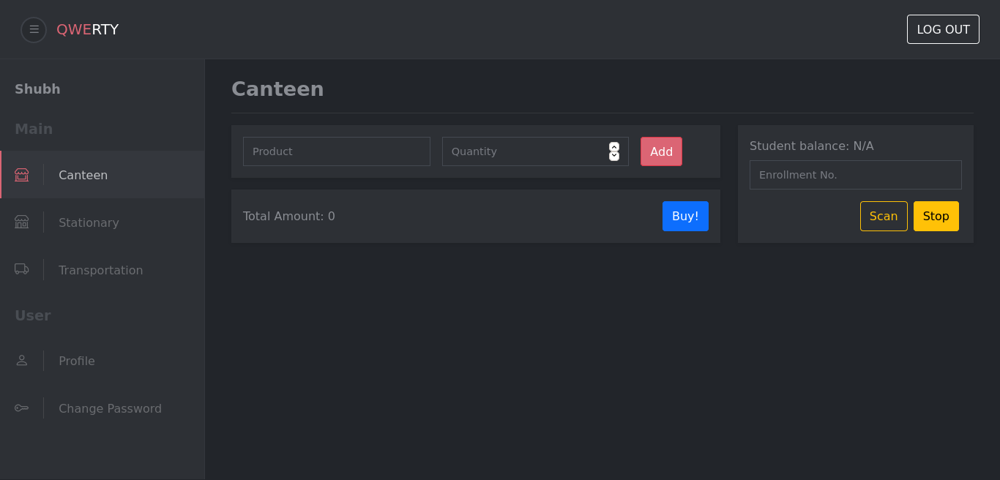
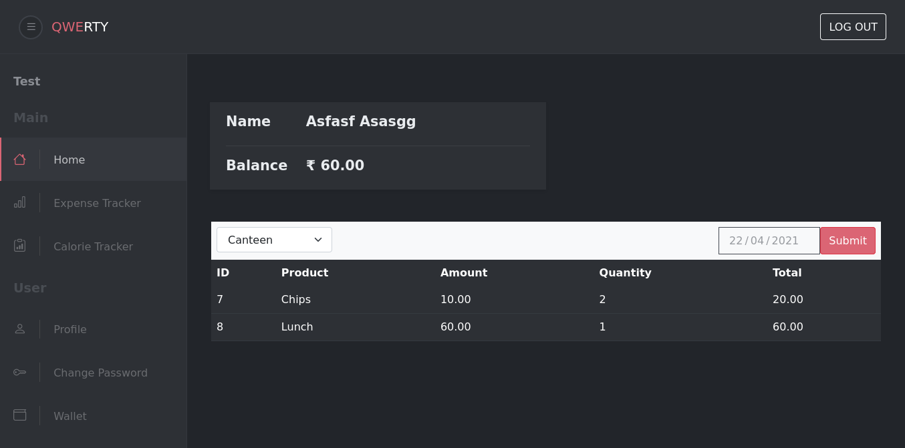
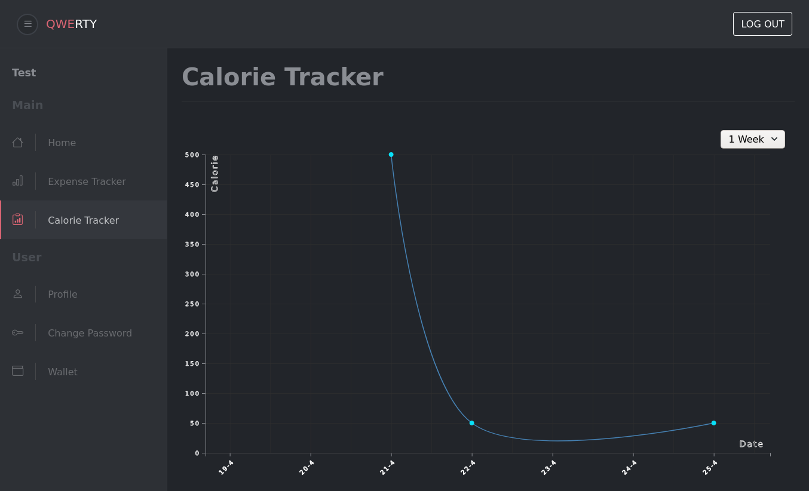

# Qwerty
This Web application can be used in Schools and colleges.

 Some Features of this application are :- 
* Each student has a wallet connected with his/her account, which they can use in the school using their ID cards. The ID will have a QR code which can be scanned to pay in the school.
* Each transaction is recorded, so they can be viewed later.
* Parents can monitor the expense and calorie in-take of the student using the application.
* The managers of canteen, stationary and buses will have a manager account, which they can use to perform the transactions.

**LOGIN**

**Manager**

**Student Dashboard**

**Calorie Tracker**

